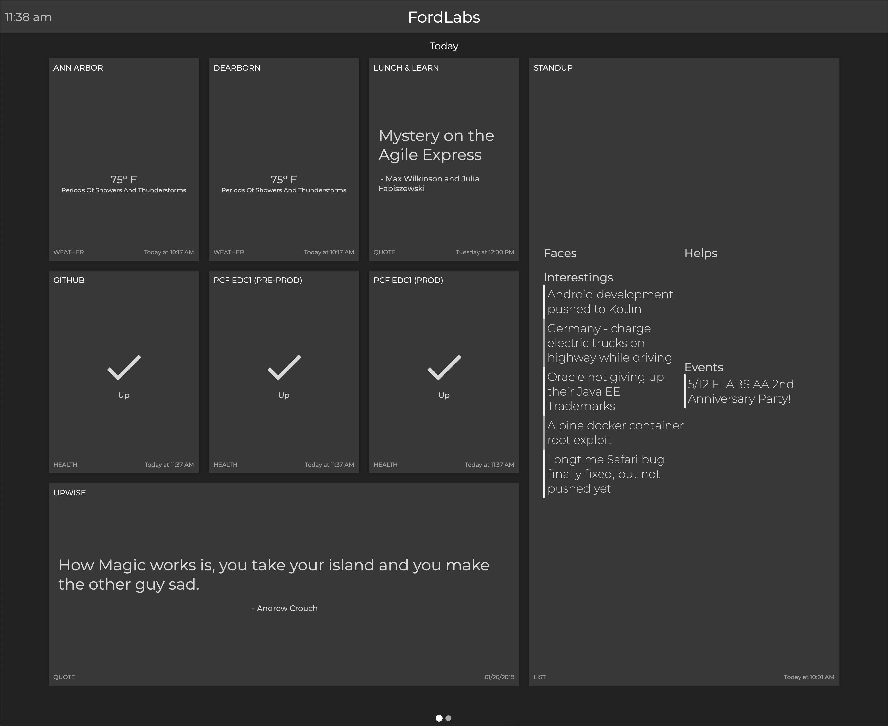

# Data as a Board

Your radiator, your way!



Data as a Board (DaaB) is an application that aggregates events (like Jenkins job status, weather changes, or twitter status updates) and publishes them in a consistent, abstract way.

This information can then be consumed by a variety of applications.  DaaB includes a radiator application for displaying events on a large screen, as well as a Slack bot, but feel free to write your own client/consumer!


> DaaB is meant to serve as an example of what is possible with a unified source of events. 
The specific technologies in use at any given time are not final, and should not be interpreted as such.

## Getting Started

### Events
DaaB integrates with several event sources out of the box:

- [RetroQuest](https://retroquest.ford.com/login) action items
- Jenkins job status
- Up/Down status of a given URL
- [Upwise](http://upwise.cfapps.io/) quotes
- Weather
- [AppCenter](https://appcenter.ms) app statistics

Don't see what you're looking for?  DaaB is a generic event publisher, so create your own!  It supports the following event types:

- Quote (text, author)
- List (A list of lists)
- Weather (condition, temperature)
- Job (status, url)
- Health (status of up or down)
- Figure (value, subtext)
- Percentage
- Statistics (list of name/value pairs)

For more details see the [event setup wiki.](https://github.com/FordLabs/data-as-a-board/blob/master/docs/Event-Types.md)

### Configuration

You can tell DaaB which event sources are active and which events are displayed on the sample dashboard by editing the ```src/main/resources/application.yml``` file. 

Additionally, all credentials necessary to access any APIs will be located here. 

Refer to the [Configuring Events page](https://github.com/FordLabs/data-as-a-board/blob/master/docs/Configuring-Events.md) for example application.yml files and instructions.

### Running locally for development

DaaB requires Java 11 to run. You can use [jenv](https://www.jenv.be/) to manage your Java versions on Linux or OS X.

Redis is required to run DaaB locally, so ensure you have a Redis instance running at `localhost:6379` (the default Redis port). 

Once Redis is installed and running you can start DaaB with the Gradle `:bootRun` task. 

This starts both the DaaB service and a development radiator running on ```http://localhost:8080```

If you would like to run the backend and frontend separately, use the `service:bootRun` and `ui:start` Gradle tasks.

Note that a "production" version of the UI will still be built with the server and hosted on its port when you run `service:bootRun`. 
You should use the development UI (running on port 3000) instead of the production UI.

### Building for production

You can build a production jar (that includes the sample radiator application) by running the Gradle `build` task. 
This will place a `data-as-a-board` jar at `service/build/libs`.  This jar can be deployed to a provider of choice.

